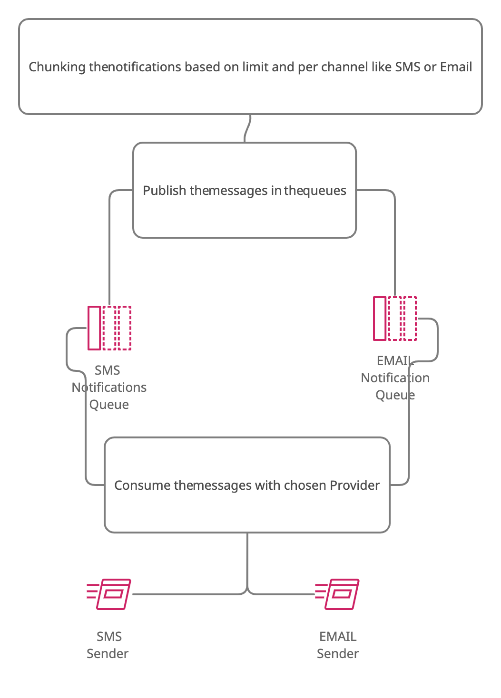

# notification-center

## System Design

Model of Notification

```json
{
    id: {
      type: 'string',
      columnName: '_id'
      description: "UUID of the message"
    },
    body: {
      type: 'string',
      required: true,
      description: "Its body"
    },
    type: {
      type: 'string',
      required: true,
      isIn: [
        NotificationTypes.GROUP,
        NotificationTypes.INDIVIDUAL
      ],
      description: "Type of the message if it is personlized or for-group"

    },
    status: {
      type: 'string',
      defaultsTo: NotificationStatus.CREATED,
      description: "Status for message to track them from CREATED to In progress to SENT or failed"
    },
    channel: {
      type: 'string',
      required: true,
      isIn: [
        Providers.EMAIL,
        Providers.SMS,
      ],
      description: "Provider that will be sent by"
    },
    receivers: {
      type: 'ref',
      required: true
      description: "The users phones or their emails"
    },
    priority: {
      type: 'number',
      defaultsTo: NotificationPrioritieis.LOW,
      description: "priority of message if it's immediate or not"
    }
}
```



1. First I Chunked the Notification by limit because the number of requests of providers (SMS, Email) can handle per minute are
limited. (with adding the priority in each notifaction to send the highest ones like immediate ones)
2. then published the chunked data into two queues (one for SMS and the other for Email)

## HOW TO INSTALL (without docker)

- You must have `node version above v12` ,mongodb ,and rabbitmq
- install `sails.js` --> `npm run -g sails`
- then run `npm install`

## HOW TO INSTALL (with docker)

- RUN `docker-compose up`


## HOW TO INSTALL (inside a Kubernetes Cluster)

- you can find the helm chart on (k8s) folder
## APIS

POST /notification
headers: Content-Type: application/json
body:
```json
{
    "body": "hello",
    "type": "individual",
    "channel": "sms",
    "receivers": [
        {
            "phone": 1234344
        }
    ]
}
```
## Commands

`NODE_ENV={env} sails run chunk-notifications --limit={integer: the limit of notifactions in a chunk} --channel={string: type of provider (sms or email)}`

## HOW TO TEST

1. run `npm start`
2. hit in the postman(or like that) the API 
POST /notification
headers: Content-Type: application/json
body:
```json
{
    "body": "hello",
    "type": "individual",
    "channel": "sms",
    "receivers": [
        {
            "phone": 1234344
        }
    ]
}
```
4. then run `NODE_ENV=dev sails run chunk-notifications --limit=1 --channel=sms`
 Or with docker `docker-compose exec api NODE_ENV=docker sails run chunk-notifications --limit=1 --channel=sms`

## TODO

- Adding Unit testing and integration
- Adding the Providers of SMS and Email like interfaces

## Author

- Mohamed Essam Fathalla <mohamedessamfathalla@gmail.com>